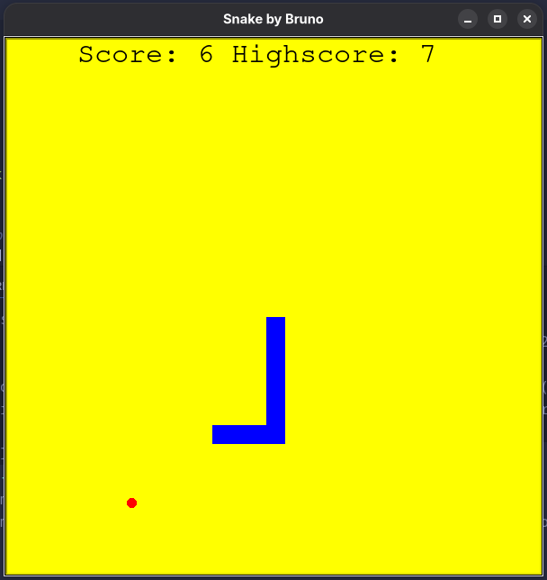

# Snake Game



A classic Snake game written in Python using the Turtle library.

## Features

- WASD controls
- Random food spawning
- Score tracking
- Highscore saving
- Collision detection
- Snake growth

## Technologies

- Python 3
- Turtle

## Run

```bash
python main.py
```